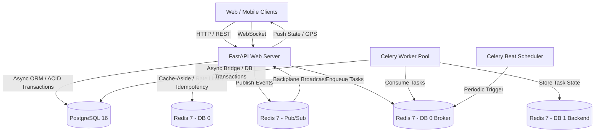
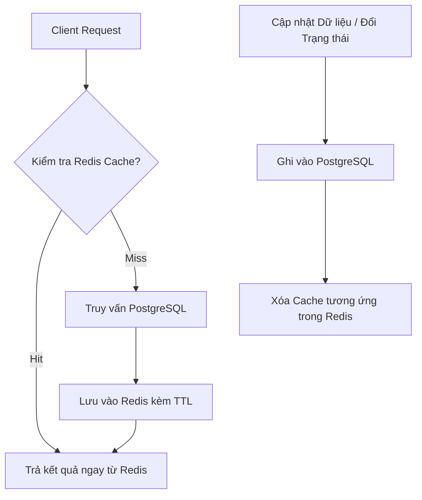
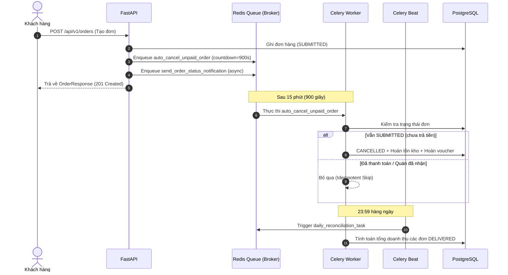
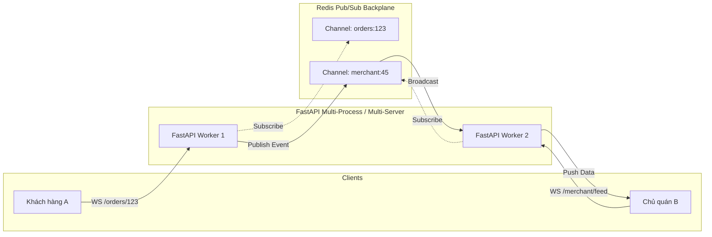
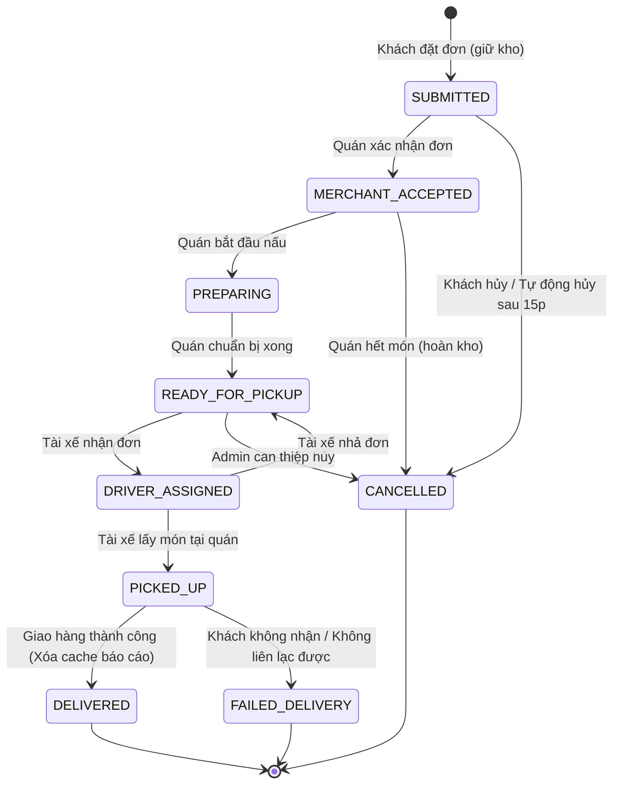

# BẢN MÔ TẢ KIẾN TRÚC HỆ THỐNG FOODHUB
*(FoodHub Backend Architecture & Technical Design Document)*

---

## 1. TỔNG QUAN KIẾN TRÚC & C4 CONTAINER DIAGRAM

**FoodHub** là nền tảng Backend chịu tải cao cho dịch vụ đặt và giao đồ ăn, phục vụ 4 nhóm tác nhân: **Khách hàng (Customer)**, **Chủ quán (Merchant)**, **Tài xế (Driver)**, và **Quản trị viên (Admin)**.

Hệ thống được thiết kế theo kiến trúc phi tập trung, phân tách rõ ràng giữa lớp xử lý HTTP đồng bộ (FastAPI), lớp tác vụ nền bất đồng bộ (Celery Worker & Beat), lớp cache/realtime (Redis 7), và lớp cơ sở dữ liệu quan hệ chuẩn ACID (PostgreSQL 16).



---

## 2. TRỤ CỘT 1: CƠ SỞ DỮ LIỆU NÂNG CAO & KIỂM SOÁT ĐỒNG THỜI (DATABASE & CONCURRENCY)

### 2.1. Kiểm soát đồng thời: Chống Oversell Tồn kho & Voucher (Race Condition)
Trong kịch bản flash-sale, hàng trăm khách hàng cùng bấm đặt một món đặc biệt (ví dụ `stock = 5`) hoặc cùng áp dụng một voucher giới hạn (`usage_limit = 100`) tại cùng một mili-giây.

#### Các giải pháp đã cân nhắc:
1. **Pessimistic Locking (`SELECT ... FOR UPDATE`):**
   * *Ưu điểm:* Đảm bảo tính tuần tự tuyệt đối.
   * *Nhược điểm:* Giữ khóa hàng (row-level lock) trong toàn bộ thời gian của transaction, gây nghẽn kết nối (connection pool exhaustion), tăng latency và dễ phát sinh Deadlock khi có nhiều bảng phụ thuộc (`menu_items`, `vouchers`, `orders`).
2. **Optimistic Locking (`version` column):**
   * *Ưu điểm:* Không giữ khóa, throughput cao khi ít tranh chấp.
   * *Nhược điểm:* Dưới tải tranh chấp cực cao (flash-sale), tỷ lệ abort/retry tăng vọt, gây lãng phí tài nguyên CPU và DB IOPS do phải rollback liên tục.
3. **LỰA CHỌN THỰC THẾ: Atomic SQL Update with Condition (`UPDATE ... WHERE condition RETURNING ...`)**
   * Hệ thống áp dụng câu lệnh cập nhật có điều kiện ở tầng Database Engine:
   ```sql
   -- Trừ kho nguyên tử
   UPDATE menu_items 
   SET stock_quantity = stock_quantity - :qty 
   WHERE id = :item_id 
     AND is_available = TRUE 
     AND stock_quantity >= :qty 
   RETURNING id, stock_quantity;

   -- Tăng lượt dùng voucher nguyên tử
   UPDATE vouchers 
   SET used_count = used_count + 1 
   WHERE id = :voucher_id 
     AND is_active = TRUE 
     AND used_count < usage_limit 
     AND valid_from <= :now AND valid_to >= :now 
   RETURNING id, used_count;
   ```
   * *Lý do lựa chọn:* Database engine (PostgreSQL/MVCC) tự động serialize các câu lệnh `UPDATE` trên cùng một bản ghi thông qua row lock tức thời mà không cần giữ khóa xuyên suốt transaction dài. Nếu điều kiện `stock_quantity >= :qty` hoặc `used_count < usage_limit` không thỏa mãn, câu lệnh trả về `0 rows affected` ngay lập tức $\rightarrow$ Bắn lỗi HTTP 400 Bad Request trả về cho client tức thì mà không gây deadlock hay nghẽn worker.

### 2.2. Tính nguyên tử đa bảng (Multi-Table Atomic Transaction)
Toàn bộ thao tác tạo đơn trong `create_order_transaction` được gói trọn vẹn trong 1 `AsyncSession` transaction:
1. Validate nhà hàng mở cửa và tọa độ giao hàng.
2. Kiểm tra danh mục món ăn và trừ kho nguyên tử.
3. Kiểm tra hạn mức voucher, chống dùng trùng qua bảng `voucher_usages` (Unique Constraint `(voucher_id, user_id)`), và tăng `used_count` nguyên tử.
4. Snapshot tên món và giá món vào `order_items` (`name_snapshot`, `unit_price`, `subtotal`).
5. Ghi nhận `orders` và `order_status_histories`.
6. Gọi `await db.commit()`: Nếu bất kỳ bước nào thất bại, toàn bộ thao tác tự động rollback, bảo toàn 100% tính nhất quán.

### 2.3. Loại trừ triệt để lỗi N+1 Query (Eager Loading)
Khi truy vấn danh sách đơn hàng hoặc chi tiết đơn hàng, SQLAlchemy mặc định sử dụng Lazy Loading sẽ phát sinh $1 + N$ câu lệnh SELECT.
* *Giải pháp:* Sử dụng `selectinload(Order.items)` và `selectinload(Order.histories)`.
```python
stmt = (
    select(Order)
    .options(selectinload(Order.items), selectinload(Order.histories))
    .where(Order.id == order_id)
)
```
Kỹ thuật này phát sinh chính xác 2 câu query tối ưu (dùng toán tử `IN (:order_ids)`), hoàn toàn triệt tiêu vấn đề N+1.

### 2.4. Đánh Index & Ràng buộc toàn vẹn CSDL
* **Composite Index:** `ix_orders_status_created_at` trên `orders(status, created_at)` phục vụ tối ưu hóa truy vấn lọc đơn theo trạng thái và thời gian.
* **Foreign Key Indexes:** Đánh index toàn bộ các khóa ngoại: `customer_id`, `restaurant_id`, `order_id`, `menu_item_id`.
* **Database Check Constraints:**
  - `check_positive_stock`: Ràng buộc `menu_items.stock_quantity >= 0` ngăn chặn lỗi âm kho ở mức vật lý.
  - `check_positive_total_amount`: Ràng buộc `orders.total_amount >= 0`.
* **Unique Constraints:** `voucher_usages(voucher_id, user_id)` đảm bảo mỗi khách chỉ được dùng 1 voucher 1 lần duy nhất ở cấp độ CSDL.

---

## 3. TRỤ CỘT 2: CHIẾN LƯỢC CACHING & DỮ LIỆU PHÂN TÁN (REDIS)

Redis đóng vai trò là lớp đệm hiệu năng cao và giải quyết các bài toán phân tán.



### 3.1. Cache-Aside Pattern & Explicit Invalidation Strategy
1. **Menu nhà hàng (`menu:restaurant:{id}`):**
   * *Đọc:* Client gọi xem menu quán $\rightarrow$ Đọc từ Redis. Nếu miss $\rightarrow$ đọc DB và lưu vào Redis với **TTL 3600s** (1 giờ).
   * *Xóa (Invalidation):* Bất kỳ thao tác thêm mới (`POST /items`), sửa giá/tồn kho (`PATCH /items/{id}`), hoặc xóa món (`DELETE /items/{id}`) đều kích hoạt `await redis.delete(f"menu:restaurant:{restaurant_id}")`.
2. **Báo cáo doanh thu (`reports:revenue:{scope}:{start_date}:{end_date}`):**
   * *Đọc:* SQL Aggregation nặng $\rightarrow$ Đọc Redis cache. Miss $\rightarrow$ tính toán DB và lưu cache với **TTL 600s** (10 phút).
   * *Xóa (Invalidation):* Ngay khi đơn hàng hoàn thành giao (`DELIVERED`), hệ thống quét và xóa toàn bộ cache báo cáo liên quan của quán đó qua pattern `reports:revenue:{restaurant_id}:*` và `reports:revenue:all:*`.

### 3.2. Idempotency Key (Chống Duplicate Order & Double Charge)
* Client sinh mã UUID qua header `X-Idempotency-Key`.
* Khi nhận request tạo đơn:
  1. Kiểm tra key `idempotency:order:{user_id}:{key}` trong Redis.
  2. Nếu đang là `"PROCESSING"`, trả về `409 Conflict` (yêu cầu đang xử lý, không bấm liên tục).
  3. Nếu key đã có `order_id`, truy vấn lại đơn cũ và trả về ngay kết quả `201/200` mà không tạo đơn mới.
  4. Đặt cờ tạm `"PROCESSING"` (TTL 60s).
  5. Sau khi lưu DB thành công, cập nhật key lưu `order_id` với **TTL 24 giờ (86400s)**.
  6. Nếu Redis gặp sự cố, fallback kiểm tra cột `orders.idempotency_key (UNIQUE)` trong PostgreSQL.

### 3.3. Sliding Window Rate Limiting
Bảo vệ các endpoint nhạy cảm (tạo đơn, đăng nhập) chống spam và brute-force:
* Sử dụng **Redis Sorted Set (ZSET)**:
  - `score` và `member` lưu timestamp thời gian thực.
  - Xóa các phần tử ngoài khung trượt: `ZREMRANGEBYSCORE key 0 (now - window)`.
  - Đếm số lượng request: `ZCARD key`.
  - Nếu vượt quá `max_requests` (VD: 5 đơn/phút, 5 lần login/phút) $\rightarrow$ Trả về `429 Too Many Requests`.

### 3.4. Ephemeral Driver GPS Tracking
* Toạ độ GPS của tài xế được đẩy lên qua `POST /api/v1/driver/location`.
* Lưu trữ tạm thời vào Redis key `driver:{user_id}:location` với **TTL 300s** (5 phút). Dữ liệu vị trí tự động hết hạn nếu tài xế ngắt kết nối hoặc mất tín hiệu.

---

## 4. TRỤ CỘT 3: HÀNG ĐỢI TÁC VỤ & BẤT ĐỒNG BỘ (MESSAGE QUEUE - CELERY)



### 4.1. Kiến trúc Cầu nối Async-Sync (Thread Pool Bridge)
* FastAPI và SQLAlchemy 2.0 hoạt động hoàn toàn bằng `asyncio`. Trong khi đó, Celery Worker truyền thống là tiến trình đồng bộ (`sync`).
* *Giải pháp:* Xây dựng helper `run_async(coro)` sử dụng `ThreadPoolExecutor` hoặc `asyncio.run()` để thực thi các coroutines async (như `AsyncSessionLocal()`) bên trong tác vụ Celery một cách an toàn, không gây xung đột Event Loop.

### 4.2. Tác vụ Trễ (Delayed Task): Tự Động Hủy Đơn Chưa Thanh Toán Sau 15 Phút
* Ngay khi đơn hàng được tạo, API lên lịch một tác vụ trễ:
  ```python
  auto_cancel_unpaid_order.apply_async(args=[order.id], countdown=900)
  ```
* **Tính Idempotent (Chạy lại an toàn):**
  - Khi worker thức dậy sau 15 phút, worker truy vấn lại trạng thái đơn từ DB.
  - Nếu `order.status != OrderStatus.SUBMITTED` (nghĩa là khách đã thanh toán hoặc quán đã nhận đơn), worker lập tức bỏ qua (`status: skipped`).
  - Nếu vẫn là `SUBMITTED`: chuyển trạng thái sang `CANCELLED`, hoàn tồn kho nguyên tử bằng SQL `UPDATE menu_items SET stock_quantity = stock_quantity + qty`, hoàn lượt voucher `used_count - 1`, và ghi log lịch sử.

### 4.3. Retry có Exponential Backoff & Jitter
* Đối với các tác vụ phụ thuộc vào bên thứ ba chập chờn (cổng thanh toán mock):
  ```python
  @celery_app.task(
      bind=True,
      autoretry_for=(TransientPaymentGatewayError,),
      retry_backoff=True,
      retry_backoff_max=60,
      retry_jitter=True,
      max_retries=3,
  )
  def process_mock_payment_with_retry(self, order_id, amount, ...):
  ```
  Cơ chế Exponential Backoff tăng dần thời gian chờ giữa các lần thử lại (1s, 2s, 4s...) kết hợp Jitter (ngẫu nhiên hóa biên độ) để chống hiện tượng thắt cổ chai (thundering herd).

### 4.4. Tác vụ Định kỳ (Celery Beat Scheduled Task)
* Cấu hình cron schedule kích hoạt lúc **23:59 hàng ngày**:
  ```python
  beat_schedule = {
      "daily-reconciliation-midnight": {
          "task": "app.tasks.reconciliation_tasks.daily_reconciliation_task",
          "schedule": crontab(hour=23, minute=59),
      }
  }
  ```
* Nhiệm vụ: Tự động tổng hợp số lượng đơn, tổng doanh thu thực tế, tiền món và phí ship của các đơn `DELIVERED` trong ngày để phục vụ đối soát tài chính.

---

## 5. TRỤ CỘT 4: WEBSOCKET REALTIME & PHÂN TÁN (WS + REDIS PUB/SUB)



### 5.1. Xác thực & Phân quyền trên WebSocket
* WebSocket không hỗ trợ truyền Custom Header khi mở kết nối từ trình duyệt.
* *Giải pháp:* Truyền JWT qua query parameter `/ws/orders/{id}?token=<jwt_token>`.
* Middleware xác thực `get_current_user_ws`:
  - Giải mã JWT token. Nếu token hết hạn hoặc sai cấu trúc $\rightarrow$ lập tức đóng kết nối với mã **`1008 POLICY_VIOLATION`**.
  - Kiểm tra quyền sở hữu đơn hàng: Chỉ **chủ đơn (Customer)**, **chủ quán (Merchant sở hữu đơn)** hoặc **Admin** mới được phép lắng nghe kênh đơn hàng. Kẻ gian cố tình nghe lén đơn người khác sẽ bị từ chối ngay lập tức.
* **Tối ưu hóa Database Connection:** Sau khi xác thực danh tính và phân quyền xong, kết nối DB Session lập tức được đóng (`await db.rollback(); await db.close()`) trước khi tiến vào vòng lặp nhận tin `while True`. Nhờ đó, hàng ngàn kết nối WebSocket giữ liên tục không bị chiếm giữ connection pool của PostgreSQL.

### 5.2. Redis Pub/Sub Backplane cho Khả năng Mở rộng Ngang (Horizontal Scaling)
* Khi triển khai ứng dụng thực tế với nhiều tiến trình Uvicorn workers hoặc nhiều container Docker: Khách hàng kết nối vào Server 1, trong khi Quán ăn kết nối vào Server 2.
* *Giải pháp:* Lớp `WebSocketManager` tích hợp **Redis Pub/Sub**:
  - Khi một sự kiện phát sinh (đổi trạng thái đơn, tài xế cập nhật GPS), API gọi `ws_manager.publish(redis, channel, message)`.
  - Redis chuyển tiếp thông điệp tới tất cả các tiến trình FastAPI đang lắng nghe channel đó, đảm bảo 100% người dùng nhận đúng dữ liệu realtime bất kể họ đang duy trì kết nối ở server nào.

---

## 6. TRỤ CỘT 5: BẢO MẬT HỆ THỐNG & OWASP DEFENSE

### 6.1. Xác thực & Phân quyền (Authentication & RBAC)
* **JWT kép:** Access Token (thời hạn 60 phút) + Refresh Token (thời hạn 7 ngày) kèm cơ chế làm mới tại `/api/v1/auth/refresh`.
* **Mật khẩu an toàn:** Băm bằng thuật toán `bcrypt` với muối (salt) tự sinh.
* **RBAC Matrix:**
  - `CUSTOMER`: Chỉ xem/hủy đơn của mình.
  - `MERCHANT`: Chỉ quản lý món ăn và đơn hàng thuộc quán mình làm chủ.
  - `DRIVER`: Chỉ nhận đơn `READY_FOR_PICKUP` và cập nhật đơn được giao cho mình.
  - `ADMIN`: Toàn quyền quản trị, xem danh sách đơn toàn hệ thống, xử lý hoàn tiền (`REFUND_ORDER`).

### 6.2. OWASP Security Middleware & Defense-in-Depth
Middleware `SecurityHeadersMiddleware` tự động gắn các header bảo mật chuẩn OWASP vào mọi HTTP response:
* `X-Frame-Options: DENY`: Chống tấn công Clickjacking.
* `X-Content-Type-Options: nosniff`: Chống tấn công MIME-type sniffing.
* `Strict-Transport-Security (HSTS)`: Ép buộc kết nối HTTPS an toàn.
* `Permissions-Policy: camera=(), microphone=(), geolocation=()`: Giới hạn truy cập phần cứng thiết bị.
* Ẩn header `Server` để không làm lộ công nghệ backend cho kẻ tấn công thăm dò.

### 6.3. Audit Trail Logging (Nhật ký Kiểm toán Hoạt động Nhạy cảm)
Mọi hành vi nhạy cảm của Quản trị viên (như hoàn tiền cho đơn hủy/thất bại qua `POST /api/v1/admin/orders/{id}/refund`) đều được ghi nhận bất biến vào bảng `audit_logs`:
* Lưu `actor_id`, hành động `action`, thực thể `entity_id`.
* Lưu trạng thái trước (`before_state`) và trạng thái sau (`after_state`).
* Lưu địa chỉ IP của người thao tác (`ip_address`).

---

## 7. MÁY TRẠNG THÁI ĐƠN HÀNG (FINITE STATE MACHINE - FSM)

Vòng đời đơn hàng được thực thi nghiêm ngặt qua ma trận chuyển đổi trạng thái:



*Mọi nỗ lực chuyển tiếp sai quy trình (ví dụ nhảy cóc từ `SUBMITTED` sang `DELIVERED`) hoặc vi phạm phân quyền role đều bị máy trạng thái `validate_state_transition` chặn đứng và trả về lỗi rõ ràng.*

